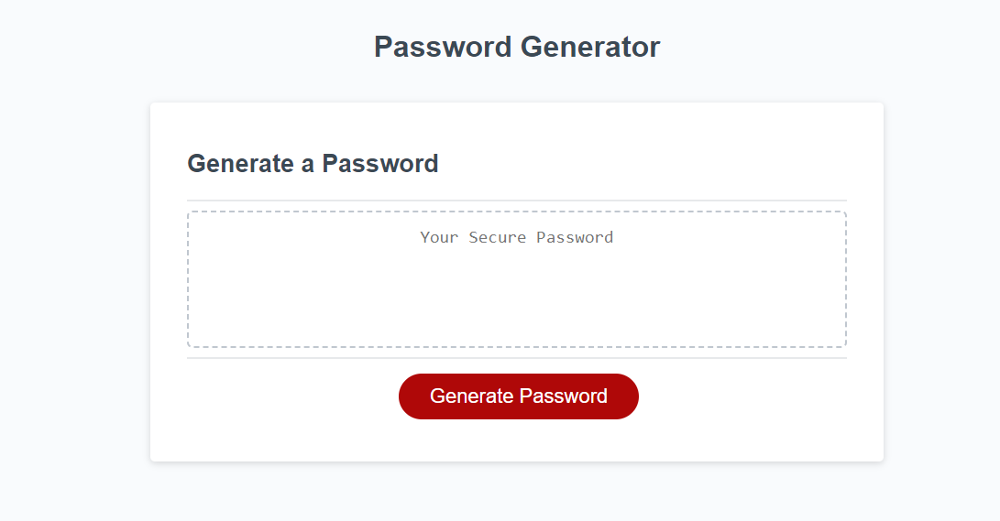

# javascript-practice
sample-portfolio-html-and-css-practice-for-learning-purposes
## challenge-password-generator
application-for-creating-random-password-of-desired-lengths
## webpage-description
can-use-application-to-create-random-password-select-generate-password-button-and-follow-prompts-to-use
## webpage-access
URL: https://brackenluke.github.io/password-generator/
## repo-access
GitHub URL: https://github.com/brackenluke/password-generator
## webpage-screenshot
Screenshot: 
